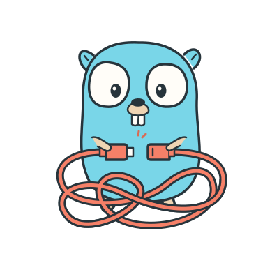

<p align="center">
  
</p>

# di

[](https://github.com/floatdrop/di/actions/workflows/ci.yml)
[](https://pkg.go.dev/github.com/floatdrop/di)
[](https://floatdrop.github.io/di/coverage.html)
[](LICENSE)
[](https://github.com/avelino/awesome-go#dependency-injection)

A dependency-injection container for Go 1.27+. Constructors are plain
functions, keys are Go types, and the container builds, starts and stops
services in dependency order.

```go
app := di.New()
app.Value(Config{DSN: "postgres://localhost/app"})
app.Wire[*DB](NewDB)     // func NewDB(Config) (*DB, error)
app.Wire[*Repo](NewRepo) // func NewRepo(*DB) *Repo

repo := app.Get[*Repo]() // builds Config, then DB, then Repo, each once
```

A registration takes `OnStart`, `OnStop` and `Worker` hooks typed on the
service, and `app.Run(ctx)` starts everything in dependency order, waits for
a signal, and stops it in reverse. Child scopes hold what belongs to one
request or one test; a second registration of a key is rejected unless it
says `Override()`; and `Explain`, `Graph` and `Modules` show what was built,
from what, and by which module.

There is no code generation and no dependency outside the standard library.
`Wire` reads a constructor's signature once, with reflection, which is how
`Validate` can check the whole graph before a single constructor runs.
`Provide` takes a closure for the rare constructor that needs the scope
itself.

[**The guide**](https://floatdrop.github.io/di/) walks through one application
file by file. [**How it works**](docs/DESIGN.md) explains what happens between
`Get` and a value, with diagrams.

## Installation

```sh
go get github.com/floatdrop/di
```

Requires Go 1.27 or newer. Editor support for generic methods needs gopls
v0.23 or newer.

## Quick start

[embedmd]:# (examples/quickstart/main.go go)
```go
// Quick start: register a few services, start and stop the application.
package main

import (
	"context"
	"fmt"
	"log"

	"github.com/floatdrop/di"
)

type Config struct{ DSN string }
type DB struct{ dsn string }
type Repo struct{ db *DB }
type Server struct{ repo *Repo }

// Plain constructors: their parameters are their dependencies.
func NewDB(cfg Config) *DB         { return &DB{dsn: cfg.DSN} }
func NewRepo(db *DB) *Repo         { return &Repo{db: db} }
func NewServer(repo *Repo) *Server { return &Server{repo: repo} }

func main() {
	app := di.New()

	app.Value(Config{DSN: "postgres://localhost/app"})

	app.Wire[*DB](NewDB).
		OnStop(func(ctx context.Context, db *DB) error { fmt.Println("db closed"); return nil })

	app.Wire[*Repo](NewRepo)

	app.Wire[*Server](NewServer).
		Eager().
		OnStart(func(ctx context.Context, srv *Server) error { fmt.Println("listening"); return nil }).
		OnStop(func(ctx context.Context, srv *Server) error { fmt.Println("server stopped"); return nil })

	ctx := context.Background()
	if err := app.Start(ctx); err != nil {
		log.Fatal(err)
	}
	defer func() {
		if err := app.Stop(ctx); err != nil {
			log.Println(err)
		}
	}()

	fmt.Println("serving", app.Get[*Server]().repo.db.dsn)
}
```

## Guide

The sections follow the order an application comes together: register
services and resolve them, give them a lifecycle, split them into scopes,
compose them from modules, and then check and inspect the result. Every
embedded example is a compiled program under [`examples/`](examples/), built
in CI.

### Registering and resolving

Each registration returns a `Binding[T]`. Its methods adjust the
registration and must be called before the scope is first resolved.

| Call | Registers |
|---|---|
| `s.Provide(func(*di.Scope) T)` | A lazily built singleton. `T` is inferred. |
| `s.Wire[T](NewT)` | A lazily built singleton from a plain constructor. Its parameters are its dependencies; see [Validate](#validate). |
| `s.Wrap[T](fn)` | A wrapper over what serves `T`: `fn` takes that value first, then its dependencies; see [Wrapping a service](#wrapping-a-service). |
| `s.Value(v)` | An instance you already have. |
| `s.Use(mods...)` | What the modules register, attributed to them by name. |

| Method | Effect |
|---|---|
| `.Scoped()` | One instance per resolving scope, built and stopped there. |
| `.Group()` | A member of the group for `T`, read back with `s.All[T]()`. |
| `.Eager()` | Build during `Start`, in registration order. |
| `.Override()` | Replace an earlier registration of `T` in this scope; a second one without it is rejected. |
| `.OnStart(f)`, `.OnStop(f)` | Lifecycle hooks, `f` is `func(context.Context, T) error`. |
| `.OnDrain(f)` | Runs before anything is stopped, while the scope still resolves. |
| `.Worker(f)` | A long-running function, cancelled on stop. |

To get a service back, call the scope, from a constructor or from outside:

| Call | Returns |
|---|---|
| `s.Get[T]()` | `T`. Inside a constructor a failure unwinds to the caller; at top level it panics with the error. |
| `s.Resolve[T]()` | `(T, error)`. Never panics on a wiring problem. |
| `s.Maybe[T]()` | `(T, bool)`; see [Optional dependencies](#optional-dependencies). |
| `s.All[T]()` | Every member of the group for `T`, across the scope chain. |
| `s.Must(v, err)` | `v`, or aborts the constructor with `err`. |
| `s.Context()` | The context passed to `Start`, so constructors can dial with a deadline. |

Errors wrap `di.ErrNotProvided`, `di.ErrCycle` or `di.ErrStopped`:

```
di: building *app.Repo (provided at app/wire.go:31): *app.DB: not provided (needed by [*app.Repo])
di: building *app.A (provided at ...): di: building *app.B (provided at ...): di: dependency cycle: [*app.A *app.B] -> *app.A
```

`Provide` takes a closure. It pulls its dependencies with `s.Get` and can do
anything else it likes, and the container learns what it needed by watching
it run. `Wire` takes a constructor as it is written, `func(A, B) T` or
`func(A, B) (T, error)`, and its parameters are its dependencies. Each one is
resolved as the closure would have resolved it, from the same scope, so
lifetimes, hooks, cycles and errors behave the same. The difference is that
a wired constructor's dependencies are known before it runs, so
[Validate](#validate) can check them and `Explain` can draw them.

`Wire` reads the signature with reflection once, when the constructor is
registered, and rejects one of the wrong shape there. Building calls it
through `reflect.Call`, about 150 ns and two allocations more than a closure;
a warm `Get` is the same code for both. Two things to know: a slice parameter
is a key like any other, not the group for its element type; and a
constructor that needs the scope itself, for `s.Context()` or a dependency
chosen at run time, stays a `Provide` closure.

An interface is served by a constructor that returns the implementation:

```go
app.Provide(func(s *di.Scope) Reader { return s.Get[*Repo]() })
app.Wire[Reader](NewRepo) // the same, when NewRepo returns *Repo
```

The compiler checks that `*Repo` satisfies `Reader`, and both keys share one
instance, since the constructor returns the same pointer. Mark it `Scoped()`
too when the target is. `Wire` needs only a result assignable to the key, so
`app.Wire[Reader](NewRepo)` serves the interface directly, and a constructor
whose result is not assignable is rejected at registration.

Three rules, all checked when the scope is next resolved:

- A second registration of a key in one scope must say `Override()`. It then
  serves the key and inherits its eagerness. A duplicate without the marker,
  or an `Override()` with nothing to override, is rejected, naming both
  registrations. A child scope shadows its parent's key without the marker,
  because that is a different scope.
- Once a key has served a value it cannot be replaced, in the scope that
  owns it or in any scope that resolved through it. A resolution that failed
  built nothing, so the key stays open.
- `Eager` on a `Scoped` binding, and `Scoped` on a `Value`, are rejected
  whichever order the methods were called in.

#### Optional dependencies

There is no `optional` marker on a parameter. A key is provided or it is not,
and a dependency nothing provides is an error — so a service that can do
without something says so by providing the absence instead.

The first way is a nil default. `s.Value[*Cache](nil)` provides the key with
nothing in it, and `*Cache` stays an ordinary declared dependency: `Validate`
checks the edge, `Explain` draws it, and a deployment that has a cache
overrides it. The constructor takes the parameter as it takes any other and
handles the nil.

For an interface, a null object goes further: provide an implementation that
does nothing, and nothing downstream has a branch to write at all. Either way
the absence is a registration with a call site, which is what `Explain` and
`Modules` report, and the key really is provided — so the rules above still
hold. An `Override()` before anything resolves is how the real one gets in,
and once the nil has been served a later registration of `*Cache` in that
scope is rejected, so the two halves of the program cannot end up disagreeing
about whether there is a cache.

Branching on presence is the third way, and it is for a key nothing registers
at all. `s.Maybe[T]()` returns `(T, bool)`, where false means no scope in the
chain provides `T`, and only a `Provide` closure can ask:

<details>
<summary><code>examples/optional/main.go</code>, the program that prints the output below</summary>

[embedmd]:# (examples/optional/main.go go)
```go
// Optional dependencies: a key that a deployment may or may not have. A nil
// default and a null object keep every declared edge provided, so the graph
// still checks; Maybe answers presence when a constructor has to branch on a
// key nothing registered at all.
package main

import (
	"fmt"

	"github.com/floatdrop/di"
)

type Cache struct{ addr string }
type Tracer struct{}
type Store struct{ cache *Cache }
type Report struct{ line string }

type Metrics interface{ Count(string) }

type nopMetrics struct{}
type logMetrics struct{}

func (nopMetrics) Count(string)   {}
func (logMetrics) Count(n string) { fmt.Println("count:", n) }

// The constructors know nothing about di. A dependency that may be absent is
// a parameter like any other, and the nil is the absence.
func NewCache() *Cache          { return &Cache{addr: "localhost:6379"} }
func NewNopMetrics() nopMetrics { return nopMetrics{} }
func NewLogMetrics() logMetrics { return logMetrics{} }

func NewStore(c *Cache, m Metrics) *Store {
	m.Count("store.built")
	return &Store{cache: c}
}

// Something has to handle the absence, and this is where it happens.
func (s *Store) Get(key string) string {
	if s.cache == nil {
		return "db:" + key
	}
	return "cache:" + key
}

// A closure is what can ask whether a key is registered at all: Maybe is
// (T, bool), and false means nothing in this scope or above provides it.
func NewReport(s *di.Scope) *Report {
	line := s.Get[*Store]().Get("1")
	if _, ok := s.Maybe[*Tracer](); ok {
		line = "traced(" + line + ")"
	}
	return &Report{line: line}
}

// Base is the wiring every deployment shares. *Cache is provided as nil and
// Metrics as a null object, so *Store has no unprovided dependency and needs
// no di import to say it can do without them.
func Base(s *di.Scope) {
	s.Value[*Cache](nil)
	s.Wire[Metrics](NewNopMetrics)
	s.Wire[*Store](NewStore)
	s.Provide(NewReport)
}

func main() {
	plain := di.New()
	plain.Use(Base)

	// Every declared edge is provided, so there is nothing to report. The
	// closure is unchecked, which is what asking with Maybe costs.
	v := plain.Validate()
	fmt.Println("errors:   ", v.Err())
	fmt.Println("unchecked:", v.Unchecked)
	fmt.Println("plain:    ", plain.Get[*Report]().line)

	// A deployment that has a cache and a tracer registers them. The
	// defaults are overridden, and nothing that depends on them changes.
	full := di.New()
	full.Use(Base)
	full.Wire[*Cache](NewCache).Override()
	full.Wire[Metrics](NewLogMetrics).Override()
	full.Value(&Tracer{}) // a new key in this scope, so no marker is needed
	fmt.Println("full:     ", full.Get[*Report]().line)
	fmt.Print(full.Explain[*Store]())
}
```

</details>

```
errors:    <nil>
unchecked: [*main.Report (provided at main.Base (main.go:62))]
plain:     db:1
count: store.built
full:      traced(cache:1)
*main.Store: singleton in root, built (provided at main.go:61)
├── *main.Cache: singleton in root, built (provided at main.go:80)
└── main.Metrics: singleton in root, built (provided at main.go:81)
needed by: *main.Report in root
```

Three things to know:

- A nil default makes the key present, so `Maybe[*Cache]()` reports it as
  provided — with a nil value. The two are answers to different questions:
  whether anything provides the key, and whether there is anything in it.
- `Maybe` records nothing when the key is absent, so a registration of it
  afterwards is not rejected, and a constructor that already ran will not see
  it. A nil default is the better answer whenever the key can be named up
  front.
- Asking with `Maybe` needs a closure, and a closure's dependencies are known
  only once it runs, so it is listed as unchecked by
  [Validate](#validate) instead of checked.

Without the default, the same graph fails as any missing dependency does.
`Validate` says so with nothing built, because `*Store` was wired, and the
resolution says so again with its path:

```
di: *main.Cache: not provided (needed by [*main.Store], provided at main.Base (main.go:61))
di: building *main.Report (...): di: building *main.Store (...): di: *main.Cache: not provided (needed by [*main.Report *main.Store])
```

A pointer parameter is not treated as optional on its own. Nearly every
dependency in Go is a pointer or an interface, so that rule would make almost
every wiring mistake a nil dereference inside a constructor rather than an
error naming the resolution path, and would leave `Validate` with nothing to
prove. Coming from fx or dig, this is the `optional:"true"` tag on a `dig.In`
field; there are no parameter objects here, so the absence is registered
rather than tagged.

### Lifecycle

`Start` builds every `Eager` binding, then runs `OnStart` hooks in build
order. If a constructor or hook fails, `Start` stops what had started, child
scopes included, and returns both errors. A service built after `Start` runs
its `OnStart` as it is built, so nothing is handed out unstarted.

`Stop` has three phases: drain, stop the child scopes, then run `OnStop`
hooks in reverse build order. Every failure is joined into the returned
error. A service is stopped when its `OnStart` succeeded or when it has no
`OnStart`, in which case `OnStop` is a plain destructor. After `Stop`, the
scope and everything under it refuses to resolve with `di.ErrStopped`.

`Stop` is safe to call twice or concurrently. The first call does the work;
the others wait for it and report its result. That is also why a hook must
not call `Stop` on its own scope or an ancestor, which would wait on itself.
Call `Shutdown`, which never blocks.

`OnStart` should return when the service is ready, not run it. A server binds
its listener in the hook, so a busy port fails `Start`, and serves in a
goroutine.

#### Draining

`OnDrain` runs before anything is stopped, innermost scope first and in
reverse build order, while every scope still resolves. It is where a service
stops taking new work and finishes what it has.

```go
app.Wire[*http.Server](newServer).Eager().
    OnDrain(func(ctx context.Context, srv *http.Server) error { return srv.Shutdown(ctx) }).
    OnStop(func(ctx context.Context, srv *http.Server) error { return srv.Close() })
```

An HTTP server is the case that needs it. Its handlers hold request scopes
under the application scope. Shutting the server down from `OnStop` would
race the teardown of those scopes, and a request in flight would fail with
`di.ErrStopped` before the server finished waiting for it. Draining first
keeps the handlers' scopes alive until they return.

#### Workers

`Worker` is for anything that loops until told to stop: consumers, pollers,
schedulers.

```go
app.Wire[*Mailer](newMailer).Eager().Worker(func(ctx context.Context, m *Mailer) error {
    return m.Loop(ctx) // returns when ctx is cancelled
})
```

The function starts in its own goroutine when the service starts. Its
context is cancelled when the service stops, and `Stop` waits for it within
the stop deadline. A worker that returns an error calls `Shutdown`, so a dead
worker takes the application down instead of leaving it half alive, even when
the failure surfaces during shutdown. The one return that means nothing is
`context.Canceled` after cancellation: the worker stopped because it was told
to.

#### Run and Shutdown

`Run` is the helper for `main`. It starts the scope and blocks until the
context is cancelled, `SIGINT` or `SIGTERM` arrives, or `Shutdown` is called.
Then it stops everything with a bounded context. A second signal during the
stop cancels that context, so a hung hook cannot keep the process alive.

<details>
<summary><code>examples/server/main.go</code>, an HTTP server with OnStart, OnDrain and OnStop, run with a stop timeout</summary>

[embedmd]:# (examples/server/main.go go)
```go
// Graceful shutdown of an HTTP server.
//
// Run starts the scope, waits for SIGINT/SIGTERM or a Shutdown call, then
// stops everything in reverse order with a bounded context. The server's
// OnDrain calls http.Server.Shutdown, which stops accepting connections and
// waits for in-flight requests until the stop context expires. Draining runs
// before anything is torn down, so those requests still have their scopes.
package main

import (
	"context"
	"errors"
	"fmt"
	"log"
	"net"
	"net/http"
	"time"

	"github.com/floatdrop/di"
)

type DB struct{ dsn string }

func main() {
	app := di.New()

	app.Wire[*DB](func() *DB { return &DB{dsn: "postgres://localhost/app"} }).
		OnStop(func(ctx context.Context, db *DB) error { log.Println("db closed"); return nil })

	app.Wire[http.Handler](func(db *DB) http.Handler {
		return http.HandlerFunc(func(w http.ResponseWriter, r *http.Request) {
			time.Sleep(2 * time.Second) // simulate slow work that must not be cut short
			fmt.Fprintln(w, "served by", db.dsn)
		})
	})

	app.Wire[*http.Server](func(h http.Handler) *http.Server { return &http.Server{Addr: ":8080", Handler: h} }).
		Eager().
		OnStart(func(ctx context.Context, srv *http.Server) error {
			// Bind synchronously so a busy port fails Start; serve in the background.
			ln, err := net.Listen("tcp", srv.Addr)
			if err != nil {
				return err
			}
			log.Println("listening on", ln.Addr())
			go func() {
				if err := srv.Serve(ln); !errors.Is(err, http.ErrServerClosed) {
					app.Shutdown(err) // the listener died: stop the whole application
				}
			}()
			return nil
		}).
		// OnDrain runs before anything is stopped, so handlers that are
		// still running keep their scopes and dependencies.
		OnDrain(func(ctx context.Context, srv *http.Server) error {
			log.Println("draining")
			return srv.Shutdown(ctx) // waits for in-flight requests, bounded by StopTimeout
		}).
		OnStop(func(ctx context.Context, srv *http.Server) error { return srv.Close() })

	// Blocks until Ctrl-C, SIGTERM, or app.Shutdown. A second signal cancels
	// the stop context so a hung hook cannot keep the process alive.
	if err := app.Run(context.Background(), di.StopTimeout(10*time.Second)); err != nil {
		log.Fatal(err)
	}
}
```

</details>

### Scopes

A child scope resolves through its parent, shares the parent's singletons,
and owns what it builds itself.

[embedmd]:# (examples/scopes/main.go go)
```go
// Scopes: a child scope sees everything in its parent and can shadow it.
package main

import (
	"fmt"

	"github.com/floatdrop/di"
)

type DB struct{ dsn string }
type User struct{ Name string }
type Handler struct {
	db   *DB
	user *User
}

func NewHandler(db *DB, user *User) *Handler { return &Handler{db: db, user: user} }

func main() {
	app := di.New()
	app.Wire[*DB](func() *DB { return &DB{dsn: "postgres://localhost/app"} })

	// One child per request: request-scoped values live here, shared
	// singletons such as *DB are reused from app.
	req := app.Child("request")
	req.Value(&User{Name: "ada"})
	req.Wire[*Handler](NewHandler)

	h := req.Get[*Handler]()
	fmt.Println(h.user.Name, "->", h.db.dsn)
	fmt.Println("same db:", h.db == app.Get[*DB]())
}
```

A singleton is built in the scope that registered it, so a child cannot
rewire a parent's singleton. A service that has to see a child's values is
marked `Scoped()`: one instance per resolving scope, built there.

#### Request scopes

A `dihttp.Middleware` gives each request a child scope holding the
`*http.Request`, attaches it to the request context, and stops it when the
handler returns. It has the usual `func(http.Handler) http.Handler` shape,
so a router accepts it too. `dihttp.Module` registers one, and a server's
constructor takes it like any other dependency:

```go
import "github.com/floatdrop/di/dihttp"

app.Use(dihttp.Module, api.Module)

func NewServer(cfg Config, mw dihttp.Middleware) *http.Server {
    mux := http.NewServeMux()
    mux.Handle("GET /users/{id}", dihttp.Handle((*Users).Show))
    mux.Handle("GET /healthz", dihttp.Handle((*Health).Check))
    return &http.Server{Addr: cfg.Addr, Handler: mw(mux)}
}
```

`dihttp.Handle` resolves a handler type from the request's scope and calls
the method. A method expression names both, so one type per resource, with a
method per route, keeps its dependencies in one place. Mark the type
`Scoped()` when it needs the request and leave it a singleton when it does
not; `Handle` follows either. A handler written by hand reaches the scope
with `di.FromContext(r.Context())`, and `dihttp.NewMiddleware(app)` makes a
middleware outside the container.

Services that depend on the request are declared once, in the root, as
`Scoped()`. They are built per request, kept for its duration, and stopped
with it:

```go
app.Wire[*User](func(r *http.Request) *User { return &User{Name: r.Header.Get("X-User")} }).Scoped()
```

`di.WithScope` and `di.FromContext` are the primitives when `net/http` is
not in the picture. A complete service with a worker, a health endpoint,
request scopes and graceful shutdown is in
[`examples/app`](examples/app/main.go).

#### Groups

`Group()` makes a registration one member of the group for its type instead
of the binding for it, and `All` resolves every member across the scope
chain. The usual case is a health endpoint: a group of checkers, and a
handler that decides what healthy means.

```go
type Checker interface{ Check(ctx context.Context) error }

app.Wire[Checker](func(db *DB) Checker { return db }).Group()

mux.HandleFunc("GET /healthz", func(w http.ResponseWriter, r *http.Request) {
    for _, c := range app.All[Checker]() {
        if err := c.Check(r.Context()); err != nil {
            http.Error(w, err.Error(), http.StatusServiceUnavailable)
            return
        }
    }
    fmt.Fprintln(w, "ok")
})
```

`All` builds any member not built yet, so a checker's target is up by the
time it is asked. Members keep their own lifetimes and hooks. A plain
registration of the same type is neither shadowed by the group nor part of
it.

#### More than one instance of a type

A key is a Go type, so two live instances of one type need two types. While
the set is fixed — a primary and a replica, two HTTP clients with different
timeouts — a defined type names each one, and embedding keeps the methods:
`type Primary struct{ *DB }`. The surrogate appears in constructor signatures
and nowhere else. `Wire` resolves it like any other parameter, so nothing has
to be annotated to say which instance feeds which argument, and `Validate`
and `Explain` see two distinct services rather than one type registered
twice.

When the set comes from configuration there are no types to write. Register
the instances as a group, fold them into a registry, and let the scope that
resolves the key say which one it wants: the selector is an ordinary
constructor whose parameter is the key, and `Scoped()` leaves the choice to
the resolving scope.

<details>
<summary><code>examples/instances/main.go</code>, a primary and a replica by type, and configured shards by a scoped selector</summary>

[embedmd]:# (examples/instances/main.go go)
```go
// More than one instance of a type: a defined type names each one while the
// set is fixed, and a Scoped selector picks one when the set comes from
// configuration.
package main

import (
	"context"
	"fmt"

	"github.com/floatdrop/di"
)

type DB struct{ dsn string }

func (d *DB) Query() string { return "query " + d.dsn }

// A fixed set: one defined type per instance. Embedding promotes the methods,
// so only the constructor below mentions the surrogate.
type Primary struct{ *DB }
type Replica struct{ *DB }

type Repo struct{ read, write *DB }

func NewRepo(p Primary, r Replica) *Repo { return &Repo{write: p.DB, read: r.DB} }

// A configured set: the shards are not known until the config is read, so no
// type can name them. They are registered as a group, folded into a registry,
// and picked by a value the resolving scope provides.
type Config struct{ Shards []string }

type Shard struct {
	Name string
	DB   *DB
}

type Shards map[string]*DB

type ShardName string

func selectShard(want ShardName, all Shards) (*DB, error) {
	db, ok := all[string(want)]
	if !ok {
		return nil, fmt.Errorf("no shard %q", want)
	}
	return db, nil
}

func main() {
	cfg := Config{Shards: []string{"eu-1", "us-1"}}

	app := di.New()
	app.Value(cfg)

	// Two databases, told apart by type. Each keeps its own hooks.
	app.Value(Primary{&DB{dsn: "primary"}}).
		OnStop(func(context.Context, Primary) error { fmt.Println("primary closed"); return nil })
	app.Value(Replica{&DB{dsn: "replica"}}).
		OnStop(func(context.Context, Replica) error { fmt.Println("replica closed"); return nil })
	app.Wire[*Repo](NewRepo)

	repo := app.Get[*Repo]()
	fmt.Println("writes:", repo.write.Query())
	fmt.Println("reads: ", repo.read.Query())

	// One binding per configured shard, read back together as a registry.
	for _, name := range cfg.Shards {
		app.Value(Shard{Name: name, DB: &DB{dsn: name}}).Group()
	}
	app.Provide(func(s *di.Scope) Shards {
		m := Shards{}
		for _, sh := range s.All[Shard]() {
			m[sh.Name] = sh.DB
		}
		return m
	})

	// The selector is an ordinary constructor: its ShardName parameter is the
	// key, and Scoped() leaves the choice to the scope that resolves it.
	app.Wire[*DB](selectShard).Scoped()

	for _, tenant := range cfg.Shards {
		req := app.Child(tenant)
		req.Value(ShardName(tenant))
		fmt.Println(tenant, "->", req.Get[*DB]().Query())
		_ = req.Stop(context.Background())
	}

	// The root does not provide ShardName, so Validate reports it as owed by
	// whichever scope resolves the shard rather than as a failure.
	fmt.Println("owed:", app.Validate().Owed)

	_ = app.Stop(context.Background())
}
```

</details>

Rules and traps:

- Use `Wire` for the selector rather than `Provide`. Its parameter declares
  the key, so `Validate` reports the key in `Owed` — the obligation the
  resolving scope carries — and `Validate(di.Provided[T]())` discharges it
  as a request scope would. A `Provide` closure behaves identically at run time and
  declares nothing, so the missing key is found by the first request that
  needs it.
- One key resolves to one value per scope. A caller that needs two shards at
  once reads the registry, or opens a scope for each.
- A type alias is not a new key. `type CacheDB = *DB` is the same
  `reflect.Type`, and the second registration of it is rejected as a
  duplicate. A surrogate has to be a defined type.
- A surrogate that embeds an interface satisfies that interface, so
  `type Cold struct{ Store }` compiles wherever a `Store` is wanted. It is
  still a separate key: registering `Cold` does not serve `Store`.

### Composing modules

A module is a function that registers into a scope. `Use` applies modules
in order and records which module made each registration:

```go
func Storage(s *di.Scope) {
    s.Provide(func(*di.Scope) *DB { return open(storageDSN) })
    s.Wire[*Repo](NewRepo)
}

func Caching(s *di.Scope) {
    s.Provide(func(*di.Scope) *DB { return open(cacheDSN) }) // also a *DB
    s.Wire[*Cache](NewCache)
}

app := di.New()
app.Use(Storage, Caching)
app.Get[*Repo]()
// di: *app.DB is provided at app.Storage (storage.go:12) and again at
// app.Caching (caching.go:8): a second registration of a key must be marked
// Override() to replace the first
```

Without that rule the second `*DB` would have won silently and rewired
`Storage`'s `*Repo` to `Caching`'s database. Two modules that each need a
`*DB` of their own declare distinct types, `type CacheDB struct{ *DB }`; a
module that means to replace another's registration says `Override()`.

Keys are types, so a service whose type is unexported can be named, and
therefore resolved, overridden, shadowed or wrapped, only by its own package.
That is the whole privacy model. A module exports its contract and its
`Module` function and keeps the rest lowercase:

```go
type db struct{ dsn string }               // only this package can say Get[*db]()

func Module(s *di.Scope) {
    s.Wire[*db](newDB).OnStop(func(_ context.Context, db *db) error { return db.Close() })
    s.Wire[Store](newPGStore)                  // the exported contract
}
```

`Explain`, `Graph` and `Validate` still see the private services. A test
can override exactly what is exported: the contract, or the configuration
the private service is built from.

#### Wrapping a service

`Wrap[T]` composes over whatever serves `T` at the time it is called: the
latest registration in this scope, or the one an ancestor provides. The
function takes the wrapped value first and its other dependencies after it,
and returns `T` or `(T, error)`, read the way `Wire` reads a constructor.
The wrapped registration keeps its hooks and lifetime. It is built first, as
the wrapper's dependency, and stopped after it. Wrappers chain in
registration order. uber/fx calls this `Decorate`.

<details>
<summary><code>examples/wrap/main.go</code>, the program that prints the output below</summary>

[embedmd]:# (examples/wrap/main.go go)
```go
// Wrap: compose over a service without replacing it. The wrapped
// registration keeps its hooks and lifetime, and a wrapper in a child scope
// applies to that scope alone.
package main

import (
	"context"
	"fmt"

	"github.com/floatdrop/di"
)

type Store interface{ Get(key string) string }

type PGStore struct{}
type Cache struct{ hits int }
type CachingStore struct {
	next  Store
	cache *Cache
}
type TracingStore struct{ next Store }

func (*PGStore) Get(key string) string        { return "row " + key }
func (c *CachingStore) Get(key string) string { c.cache.hits++; return c.next.Get(key) }
func (t *TracingStore) Get(key string) string { return "traced(" + t.next.Get(key) + ")" }

func NewPGStore() *PGStore                       { return &PGStore{} }
func NewCachingStore(next Store, c *Cache) Store { return &CachingStore{next: next, cache: c} }
func NewTracingStore(next Store) Store           { return &TracingStore{next: next} }

func main() {
	app := di.New()
	app.Value(&Cache{})
	app.Wire[Store](NewPGStore).
		OnStop(func(context.Context, Store) error { fmt.Println("pg closed"); return nil })

	// The first parameter is the value being wrapped; the rest are
	// dependencies. The store keeps its OnStop, and is stopped after the
	// wrapper, since it was built first.
	app.Wrap[Store](NewCachingStore)

	// A wrapper in a child scope wraps the parent's value for that scope and
	// its descendants; the parent and its other children are untouched.
	debug := app.Child("debug")
	debug.Wrap[Store](NewTracingStore)

	fmt.Println("app:  ", app.Get[Store]().Get("1"))
	fmt.Println("debug:", debug.Get[Store]().Get("1"))
	fmt.Print(app.Explain[Store]())
	_ = app.Stop(context.Background())
}
```

</details>

```
app:   row 1
debug: traced(row 1)
main.Store: singleton wrapper in root, built (provided at main.go:40)
├── main.Store: singleton in root, built (provided at main.go:34)
└── *main.Cache: value in root, built (provided at main.go:33)
needed by: main.Store in debug
pg closed
```

Three rules:

- A wrapper takes the lifetime of what it wraps, so a wrapper over a `Scoped`
  service is one per scope. `Scoped()` on the wrapper puts one wrapper per
  scope around a shared singleton.
- A wrapper in a child scope applies to that child and its descendants. The
  parent and its other children keep the original.
- `Override()` after a wrapper replaces the wrapper and everything it
  wrapped. A registration some wrapper composes over cannot be overridden
  while that wrapper stands. Nothing to wrap, a group, and a key this scope
  has already resolved are rejected.

#### Testing

`di.Test` wires the production graph into a fresh scope, stops it when the
test ends, and fails the test if a stop hook errors. Override what you need
before anything is resolved, and mark it `Override()`.

[embedmd]:# (examples/testing/repo_test.go go)
```go
package app

import (
	"testing"

	"github.com/floatdrop/di"
)

func TestRepo(t *testing.T) {
	s := di.Test(t, Production)                     // production graph, stopped when the test ends
	s.Value(&DB{DSN: "sqlite://memory"}).Override() // replaces the production *DB, and says so

	repo := s.Get[*Repo]() // built against the fake DB
	if repo.DB.DSN != "sqlite://memory" {
		t.Fatalf("got %q", repo.DB.DSN)
	}
}
```

### Checking and inspecting

#### Validate

A wired constructor's dependencies are known at registration, so the graph
they form can be checked with nothing built. `Validate` walks it and reports
what would fail: a dependency nothing provides, a cycle, or a singleton that
would build a request-scoped service in the wrong scope. A closure's
dependencies are unknown until it runs, so `Provide` registrations are listed
as unchecked rather than checked.

<details>
<summary><code>examples/wire/main.go</code>, the program that prints the output below</summary>

[embedmd]:# (examples/wire/main.go go)
```go
// Wire: plain constructors whose parameters are their dependencies, and a
// graph that is checked before anything is built.
package main

import (
	"fmt"
	"net/http"

	"github.com/floatdrop/di"
)

type Config struct{ DSN string }
type DB struct{ dsn string }
type Repo struct{ db *DB }
type User struct{ name string }
type Handler struct {
	repo *Repo
	user *User
}
type Mailer struct{ user *User }

// The constructors know nothing about di.
func NewDB(cfg Config) *DB                       { return &DB{dsn: cfg.DSN} }
func NewRepo(db *DB) *Repo                       { return &Repo{db: db} }
func NewUser(r *http.Request) *User              { return &User{name: r.Header.Get("X-User")} }
func NewHandler(repo *Repo, user *User) *Handler { return &Handler{repo: repo, user: user} }
func NewMailer(user *User) *Mailer               { return &Mailer{user: user} }

func main() {
	app := di.New()
	app.Value(Config{DSN: "postgres://localhost/app"})
	app.Wire[*DB](NewDB)
	app.Wire[*Repo](NewRepo)
	app.Wire[*User](NewUser).Scoped() // one per request scope, where the *http.Request is
	app.Wire[*Handler](NewHandler).Scoped()

	// Nothing has been built, but the constructors declared their edges, so
	// Explain draws them, dashed, down to what only a request scope provides.
	fmt.Print(app.Explain[*Handler]())
	fmt.Println()

	// Validate walks the same edges. From the application scope, *User needs
	// an *http.Request that only a request scope provides: owed, not wrong.
	v := app.Validate()
	fmt.Println("errors:", v.Err())
	fmt.Println("owed:  ", v.Owed)

	// Told what a request scope holds, the check is the one that scope
	// would make, and nothing is owed.
	fmt.Println("request scopes:", app.Validate(di.Provided[*http.Request]()).Err())

	// A singleton depending on a request-scoped service would be built in
	// app, where there is no request. A closure would fail on first use;
	// the declared graph fails here.
	app.Wire[*Mailer](NewMailer)
	fmt.Println(app.Validate().Err())
}
```

</details>

```
*main.Handler: scoped in root, not built (provided at main.go:35)
├╌╌ *main.Repo: singleton in root, not built (provided at main.go:33)
│   └╌╌ *main.DB: singleton in root, not built (provided at main.go:32)
│       └╌╌ main.Config: value in root, not built (provided at main.go:31)
└╌╌ *main.User: scoped in root, not built (provided at main.go:34)
    └╌╌ *net/http.Request: not provided

errors: <nil>
owed:   [*net/http.Request: needed by *main.User (scoped, provided at main.go:34)]
request scopes: <nil>
di: *net/http.Request: not provided in scope root (needed by [*main.Mailer *main.User]; *main.User is Scoped, so the singleton *main.Mailer would build it there)
```

| Call | Returns |
|---|---|
| `s.Validate()` | A `Validation`. `Err()` joins `Errors`, the failures the declared graph proves. `Owed` lists what a `Scoped` binding needs that this scope does not provide, left to the scope that resolves it. `Unchecked` lists the `Provide` closures. |
| `s.Validate(di.Provided[T]()...)` | The same check as the resolving scope would make it, told that it holds a `T`. With stubs nothing is owed: what neither the scope nor the stubs provide is an error. |

A singleton is checked against the scope that registered it, because that
is where it is built. A `Scoped` binding is built in whichever scope resolves
it, so `Validate` checks it as if the calling scope were that scope, and what
the calling scope does not provide is owed rather than wrong: a descendant
may provide it, as request scopes provide the request. Call `Validate` from
that descendant, or say what it will hold with `di.Provided[T]()` stubs.

#### Explain, Graph and Modules

A closure's dependencies are learned by watching it resolve them; a wired
constructor's are declared. What has been built has a recorded graph, what
was wired has a declared one, and three methods render them: `Explain` for
one service, `Graph` for everything built, and `Modules` for what each
module provides and needs.

`Explain[T]` prints the dependency tree of one service, with each node's
lifetime, scope, lifecycle phase and registration site, followed by what
needed it:

```
*main.Server: singleton in root, eager, started (provided at main.go:36)
├── *main.Repo: singleton in root, started (provided at main.go:34)
│   └── *main.DB: singleton in root, started (provided at main.go:33)
│       └── main.Config: value in root, started (provided at main.go:32)
└── *main.Cache: singleton in root, started (provided at main.go:35)
    └── *main.DB: see above

*main.DB: singleton in root, started (provided at main.go:33)
└── main.Config: value in root, started (provided at main.go:32)
needed by: *main.Repo in root, *main.Cache in root
```

A dependency reached twice is expanded once, so a diamond is drawn as one.
Registration sites are absolute paths, shortened above.

`Graph` renders everything built in a scope and its descendants as Graphviz
DOT, one cluster per scope:

```sh
go run ./examples/explain | dot -Tsvg > graph.svg
```

`Modules` is the report for whoever composes the application: which module
provides which keys, what each needs and which module serves it, what it
wraps, and which of its constructors are closures whose needs are unknown
until they run. A need only a resolving scope can provide is owed, as in
`Validate`. This is the guide application's report, before anything is
built:

[embedmd]:# (examples/guide/testdata/modules.txt)
```txt
config.Module
  provides   config.Config
storage.Module
  provides   *storage.db, storage.Store
  needs      config.Config ← config.Module
cache.Module
  provides   *cache.cache
  wraps      storage.Store ← storage.Module
mail.Module
  provides   *mail.Mailer
dihttp.Module
  provides   dihttp.Middleware
  unchecked  dihttp.Middleware (closures: needs known when they run)
api.Module
  provides   *api.Caller, *api.Users, *api.Health, *http.Server
  needs      *http.Request ← owed to a resolving scope
             storage.Store ← cache.Module
             *mail.Mailer ← mail.Module
             config.Config ← config.Module
             dihttp.Middleware ← dihttp.Module
```

None of the three builds anything. A service that has not been resolved is
shown with its registration and left alone. If it was registered with `Wire`,
its declared dependencies are drawn under it with dashed edges, each
continuing as a recorded tree where it has been built and as a declared one
where it has not, and `declared by:` names the unbuilt services that declare
it. A closure that has not run ends its branch: for closures the graph is
what ran, not what could run
([known limitation](docs/DESIGN.md#known-limitations)).

```
*main.Handler: scoped in root, not built (provided at main.go:35)
├╌╌ *main.Repo: singleton in root, not built (provided at main.go:33)
│   └╌╌ *main.DB: singleton in root, not built (provided at main.go:32)
│       └╌╌ main.Config: value in root, not built (provided at main.go:31)
└╌╌ *main.User: scoped in root, not built (provided at main.go:34)
    └╌╌ *net/http.Request: not provided
```

<details>
<summary><code>examples/explain/main.go</code>, the program that prints the first two trees in this section</summary>

[embedmd]:# (examples/explain/main.go go)
```go
// Inspecting the graph: what a service was built from, and what needed it.
//
// Dependencies are recorded as constructors resolve them, so Explain and
// Graph describe what actually happened rather than what was registered.
package main

import (
	"context"
	"fmt"
	"log"

	"github.com/floatdrop/di"
)

type Config struct{ DSN string }
type DB struct{ dsn string }
type Repo struct{ db *DB }
type Cache struct{ db *DB }
type Server struct {
	repo  *Repo
	cache *Cache
}

func NewDB(cfg Config) *DB                       { return &DB{dsn: cfg.DSN} }
func NewRepo(db *DB) *Repo                       { return &Repo{db: db} }
func NewCache(db *DB) *Cache                     { return &Cache{db: db} }
func NewServer(repo *Repo, cache *Cache) *Server { return &Server{repo: repo, cache: cache} }

func main() {
	app := di.New()

	app.Value(Config{DSN: "postgres://localhost/app"})
	app.Wire[*DB](NewDB)
	app.Wire[*Repo](NewRepo)
	app.Wire[*Cache](NewCache)
	app.Wire[*Server](NewServer).Eager()

	if err := app.Start(context.Background()); err != nil {
		log.Fatal(err)
	}
	defer func() { _ = app.Stop(context.Background()) }()

	// What the server was built from. *DB is reached through both the repo
	// and the cache, and is expanded once.
	fmt.Print(app.Explain[*Server]())

	// And the other direction: what needed the database.
	fmt.Println()
	fmt.Print(app.Explain[*DB]())

	// Everything built so far, as Graphviz DOT: dot -Tsvg > graph.svg
	fmt.Println()
	fmt.Print(app.Graph())
}
```

</details>

#### Observability

```go
app.Observe(func(ev di.Event) {
    if ev.Kind == di.EventBuild {
        buildDuration.WithLabelValues(ev.Service).Observe(ev.Duration.Seconds())
    }
})
```

Observers receive an `Event` for every constructor and every `OnStart`,
`OnDrain` and `OnStop` hook in the scope and its descendants, and one per
`Shutdown`. Each event names the service and the import path of its type, its
scope and module, the registration site, the duration, and the error if any.

For logging, [`dislog`](dislog/) is that function already written against
`log/slog`:

```go
app.Observe(dislog.New(slog.Default()))
```

The event's kind is the message and the rest are attributes. A step that
failed is logged at `slog.LevelError` with the error and the registration
site, since that is what a failure is read with; anything else at
`slog.LevelInfo`, or at the level `dislog.Level` sets — `slog.LevelDebug` is
the usual second choice, because every build is worth a line while an
application is being wired and noise once it works. `dislog.Site()` logs the
site every time. The package imports nothing beyond `log/slog`, so any
handler will do, including one that colours its output:

<details>
<summary><code>examples/observe/main.go</code>, the program that prints the output below</summary>

[embedmd]:# (examples/observe/main.go go)
```go
// Observe: the container's lifecycle as log lines. dislog.New turns a
// *slog.Logger into the observer Observe takes, so the application says what
// it is doing as it builds, starts and stops.
package main

import (
	"context"
	"log/slog"
	"os"

	charm "github.com/charmbracelet/log"
	"github.com/floatdrop/di"
	"github.com/floatdrop/di/dislog"
	"github.com/floatdrop/di/examples/observe/internal/store"
)

type Repo struct{ db *store.DB }

func NewRepo(db *store.DB) *Repo { return &Repo{db} }

func main() {
	// dislog imports only log/slog, so any handler will do. This one is
	// charmbracelet/log, which is an slog handler that colours its output.
	logger := slog.New(charm.New(os.Stderr))

	app := di.New()

	// Observers see this scope and every scope under it, so registering first
	// means the whole wiring is logged.
	app.Observe(dislog.New(logger))

	app.Value(store.Config{DSN: "postgres://localhost/app"})
	app.Use(store.Module)
	app.Wire[*Repo](NewRepo)

	ctx := context.Background()
	if err := app.Start(ctx); err != nil {
		logger.Error("start", "err", err)
		os.Exit(1)
	}

	// Built after Start, so this build is logged here, between the two
	// phases, and its OnStart would run as it is handed out. It is a type in
	// main, which has no import path to lift out, so it gets no pkg.
	_ = app.Get[*Repo]()

	// Stop returns what the hooks reported as well as logging it, so a
	// caller that wants to act on a teardown failure still can.
	if err := app.Stop(ctx); err != nil {
		logger.Warn("stopped with failures", "err", err)
	}
}
```

</details>

```
INFO build service=store.Config pkg=github.com/acme/app/internal/store scope=root duration=25.667µs
INFO build service=*store.DB pkg=github.com/acme/app/internal/store scope=root module=store.Module duration=286.333µs
INFO start service=*store.DB pkg=github.com/acme/app/internal/store scope=root module=store.Module duration=792ns
INFO build service=*main.Repo scope=root duration=26.417µs
ERRO stop service=*store.DB pkg=github.com/acme/app/internal/store scope=root module=store.Module duration=4.709µs site=store.go:20 err="di: stopping *store.DB: connection reset"
WARN stopped with failures err="di: stopping *store.DB: connection reset"
```

A service is named the way it is written in Go, with the import path lifted
out into `pkg`, since the path is most of the length and none of the meaning.
Both come from the event -- `Service` and `Package` -- so nothing is parsed,
and a key whose type is unnamed reports no package and keeps its whole name.

Observers see the scope they are registered on and every scope under it, so
one on the application scope logs request scopes too. Events arrive on the
goroutine that did the work, so a slow handler slows the application down.
[`examples/guide/cmd/api`](examples/guide/cmd/api/main.go) wires it this way.

## Performance

[`benchmarks/`](benchmarks/) is a separate module comparing this package with
[samber/do](https://github.com/samber/do) and
[uber-go/dig](https://github.com/uber-go/dig) on the same four-service graph,
so the library itself stays dependency-free. On an Apple M3 Pro:

| | Warm resolve | Cold register and build |
|---|---|---|
| `di`, `Provide` closure | 38 ns, 64 B, 2 allocs | 3.7 µs, 4.5 kB, 70 allocs |
| `di`, `Wire` | 38 ns, 64 B, 2 allocs | 4.2 µs, 4.9 kB, 77 allocs |
| `do` v2.1 | 125 ns, 192 B, 6 allocs | 6.1 µs, 11.5 kB, 120 allocs |
| `dig` v1.19 | 445 ns, 768 B, 24 allocs | 16.4 µs, 24.3 kB, 302 allocs |

`di` is measured twice because `dig.Provide` is reflective like `Wire` rather
than like a `Provide` closure. The two warm figures are the same, which is
what "a warm `Get` is the same code for both" means; the cold difference is
the signature read and `reflect.Call`, about 120 ns per constructor here.

**The `dig` warm figure needs a caveat.** dig has no typed accessor, so the
nearest thing to a resolve is `Invoke` with a function dig reflects over on
every call, and an fx application invokes once at startup and never again.
The cold comparison is the fair one, and it is the one fx cares about; read
the warm number as what dig costs if used for something it does not set out
to do — resolving on a request path, which is what `Scoped` bindings here are
for.

The cold figure counts the registration-site strings, so its byte total moves
with how deep the source sits on disk; compare allocation counts across
checkouts, not bytes.

```sh
cd benchmarks && go test -bench . -benchmem
```

## Versioning

While the major version is 0, a minor bump may change behaviour. Every entry
in [CHANGELOG.md](CHANGELOG.md) and on the
[releases page](https://github.com/floatdrop/di/releases) says whether an
upgrade can break a caller.

## Contributing

There is one regression test per historical defect, and generative suites
for the parts that proved easiest to get wrong: a property test over random
registration sequences, a model-based test over random operation sequences
checked against documented invariants and a lifecycle model, the same
operations run in parallel lanes under the race detector, and fuzz targets
over both.

```sh
go test -race ./...
go test -run '^$' -fuzz 'FuzzMachine$' -fuzztime 2m .
go test -race -run '^$' -fuzz FuzzMachineConcurrent -fuzztime 2m .
```

The code blocks in this README are embedded from `examples/` with
[embedmd](https://github.com/campoy/embedmd). After editing an example:

```sh
gofmt -w examples/ && go run github.com/campoy/embedmd@v1.0.0 -w README.md
```

## License

[MIT](LICENSE)
