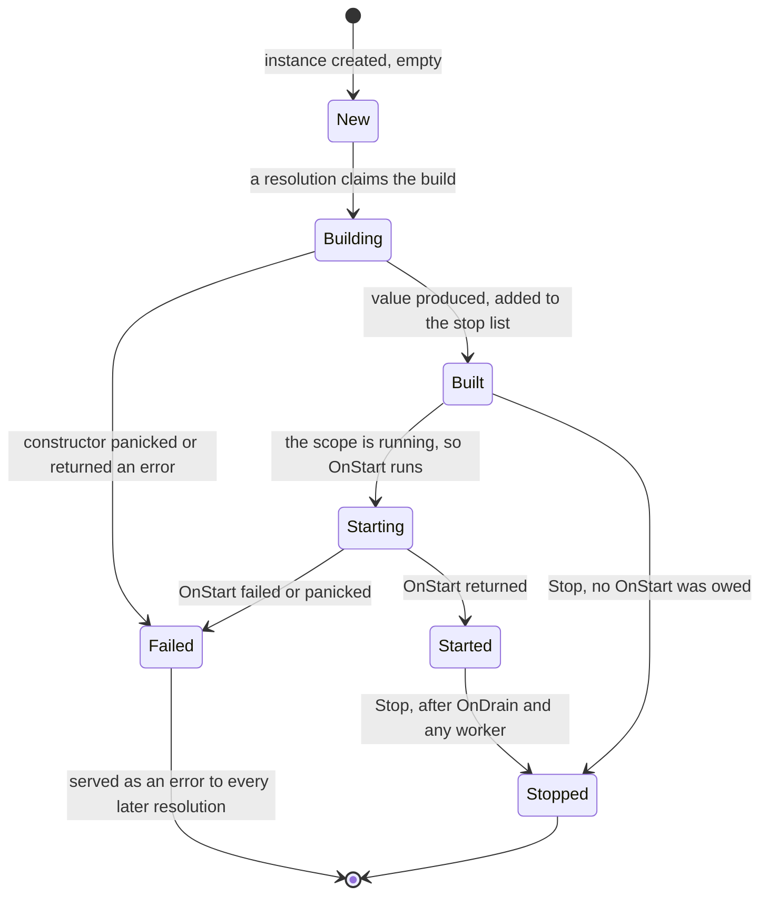
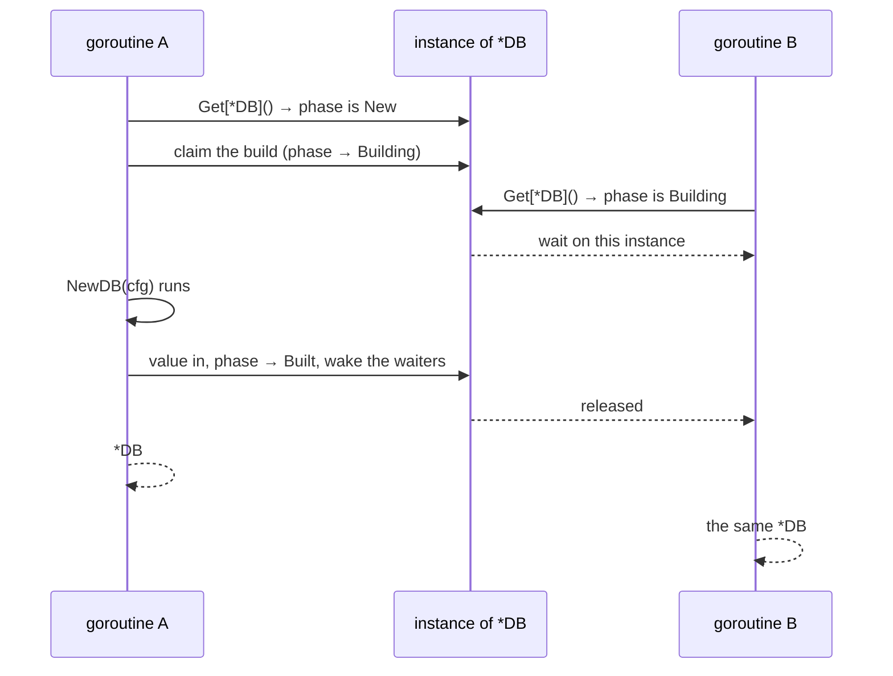
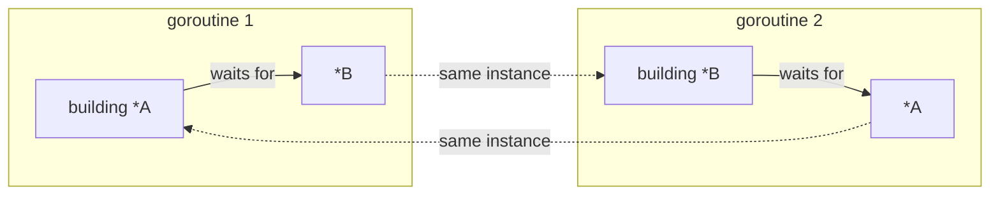
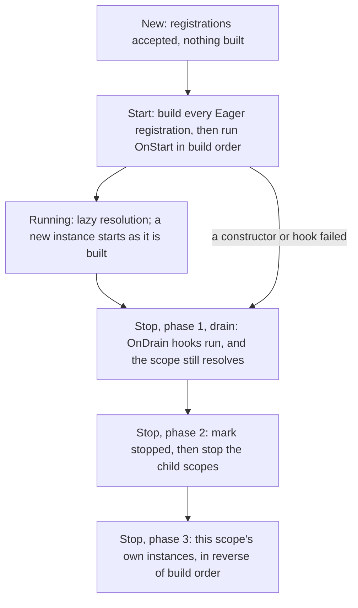

# How `di` works

What happens between `s.Get[T]()` and a `T`, drawn out. The
[README](../README.md) has the API; this is the machinery under it, and why
shutdown, scopes and cycles behave as they do.

## Registrations and instances are different things

Registering writes down *how* to make something. It runs no code and produces
no value:

```go
app.Wire[*DB](NewDB)   // a registration: the key *DB, made by NewDB
app.Get[*DB]()         // an instance: the *DB that NewDB returned
```

One registration produces zero, one, or many instances:

| It produces | When |
|---|---|
| zero instances | nobody ever asks for the key |
| one instance | the default, a singleton: every scope that asks gets the same one |
| many instances, one per scope | the registration is marked `Scoped()`: every scope that asks gets its own |

Everything below is about which instance a given `Get` lands on.

## The five moving parts

| In the docs | In the code | What it holds |
|---|---|---|
| registration | `binding` | the key, the constructor, the lifetime, the hooks |
| built value | `instance` | one value, its phase, its errors, what it needed |
| scope | `state` | a registry, the instances it holds, its lifecycle |
| path node | `resolver` | one `Get` in flight: the registration, its holder, the node that asked |
| handle | `Scope` | a pointer to one `state`, plus the current resolution path |

`Scope` is only a handle. `app` and the `*di.Scope` a constructor receives can
point at the same `state`; what differs is the path attached, which is how the
container knows who asked for what.

## One resolution, end to end

`app.Get[*Repo]()`, where `*Repo` needs `*DB`, which needs `Config`:

```
app.Get[*Repo]()
 │
 │ 1  key ← *Repo                    the Go type is the key, and a tag is a type too
 │ 2  begin a resolution             a root path node, and a recover for the abort
 │ 3  find the registration          this scope, then its parents, one at a time
 │      └─ found in app             (pending registrations commit on the way)
 │ 4  choose the holder              singleton → the scope that registered it
 │                                   Scoped    → the scope that asked
 │ 5  cycle check                    is *Repo already further up this path?
 │ 6  find the instance              in the holder. none yet → an empty one
 │ 7  build it, once
 │      └─ the constructor runs with a Scope over the holder
 │            └─ s.Get[*DB]() ────── the same nine steps, one level down
 │ 8  publish and start              add to the holder's stop list; run OnStart
 │ 9  record the edge                *Repo needed *DB. this is what Explain draws
 │
 └──→ the *Repo
```

What the diagram does not say:

- **The path is what errors are made of.** One node per `Get` in flight; a
  cycle report and a "not provided" message are the path printed. A wiring
  failure travels back up as an internal panic to the call that started the
  resolution, and becomes an `error` from `Resolve`, `Start` or `Run`, or a
  panic carrying that error from a top-level `Get`.
- **Lookup commits on the way.** Each scope it passes commits its pending
  registrations, which is when a bad one is rejected (see
  [One key, one live value](#one-key-one-live-value-per-scope)). The first
  scope that has the key wins, so a child shadows its parent. `All` collects
  group members from every scope on the way.
- **The instance is per holder.** A singleton has one instance on the
  registration. A `Scoped` registration has a map on each scope, from
  registration to instance, and step 6 reads that map.
- **One goroutine builds.** Whoever finds the instance unbuilt claims it;
  everyone else waits for that build.
- **Publishing is what owes a teardown.** The instance joins the holder's
  stop list, and if the scope is running, `OnStart` runs before the value is
  handed back.
- **The edge is recorded on the asking instance**, which is how `Explain`
  and `Graph` draw a graph nobody declared.

## Where a value lives: the holder

> The registration lives where you wrote it. The instance lives with its holder.

```
app  ── registrations:  *DB → singleton      *User → Scoped
     └─ instances:      [*DB]                 (none: nobody asked here)
         │
         ├── request A ── instances: [*http.Request]  [*User #A]
         └── request B ── instances: [*http.Request]  [*User #B]
```

Both requests resolve `*User` through one registration, written in `app`.
They get different values because the holder differs:

| Lifetime | Holder | Instances | Stopped by |
|---|---|---|---|
| singleton (default) | the scope that **registered** it | one, shared downward | that scope |
| `Scoped()` | the scope that **resolved** it | one per scope that asks | that scope |
| `Value(v)` | the scope that registered it | the value you passed | that scope |
| `Wrap` | the scope that registered the wrapper, or the resolving scope when the wrapped registration is `Scoped` | one, or one per scope | that scope, before the wrapped one |
| `Group()` member | as above, per member | each member has its own | that scope |

A wrapper resolves the registration it wraps as its first dependency, so the
wrapped value is built first and stopped after, and the wrapper takes its
lifetime.

Three consequences:

- **Nothing is ever rebuilt.** There is no staleness check. A new scope has an
  empty shelf, so the first ask there builds; the second ask in the same scope
  finds the instance.
- **A `Scoped` service is not always built.** It exists only in scopes that
  resolve it, from that moment. That is why `Eager` is refused on a `Scoped`
  registration: eager means "exists once `Start` returns", and there is no
  single instance for `Start` to build.
- **The constructor sees the scope that asked.** It is handed a view over the
  holder, so a `*User` constructor declared in `app` and resolved in request A
  resolves `*http.Request` from A.

## One key, one live value per scope

A registration is queued when you make it and committed later, in a batch, by
the first lookup that passes through the scope. That is why a bad registration
is reported by `Get`, `Start` or `Explain` rather than at the `Provide` line.

```
app.Provide(...)   app.Wire[...](...)   app.Provide(...).Override()
        │                  │                       │
        └──────────────────┴───────────────────────┘  queued, not looked at
                           │
                     first lookup ──► validate the batch against a copy of the registry
                                          ├─ every registration stands → commit all
                                          └─ one is rejected → commit none, panic, same answer next time
```

The batch is checked against a copy, so a rejected batch leaves the scope as
it was and is rejected identically every later time. Five guards each close
one way of getting two live values for a key:

| Guard | Rejects | Because |
|---|---|---|
| collision | a second registration of a key without `Override()` | last-wins let one module rewire another silently |
| `used` | replacing or wrapping a key that has served a value | callers already hold the old value |
| `resolving` | replacing a key while a resolution of it is in flight | the nested build would get the new value, the caller the old |
| `served` | registering a key this scope already handed down from an ancestor | the scope would have given out two values for one key |
| `wrappers` | overriding a registration a wrapper in a live scope composes over | the wrapper would serve a value built from a registration nothing else can reach; a stopped scope's wrappers no longer count |

Two things are not guarded. A child shadows its parent's key without
`Override()`, because that is a different registry. And `Override()` with
nothing in the same scope to override is rejected, since a fake for a renamed
service would otherwise be a registration nobody resolves.

`served` is the one fact in that table a resolution leaves behind rather than a
registration: the scope handed the key down, so registering it here now would
give it two live values. It is recorded from the resolving scope as far as the
owner, taking each mutex in turn.

## Two questions a build can ask that time changes

`Maybe[T]` asks whether anything provides T; `All[T]` asks who is in the group
for T. Neither is the kind of question the guards above defend, because neither
has one answer per scope. Both are about the chain *as it stands*: a scope below
may answer them differently, `All` re-reads membership on every call, and a
member registered in a child is invisible to a parent's reader by design. So a
key or a member that arrives later is not a contradiction, and registering it is
never rejected — the guards protect against two live values, which breaks
ownership and teardown, and nothing here does that. Stale presence only
surprises.

It surprised silently, though: a service built before an optional dependency
was wired holds "absent" for ever, and a member registered after a singleton
read the group never reaches that value. So both answers are recorded on the
asking instance, and `Explain` of what arrived late names the values that were
built without it:

```
*app.Tracer: value in root, not built (provided at tracing.go:8)
missed by: *app.Router in root

app.Route: singleton group member in root, not built (provided at routes.go:44)
missed by: *app.Router in root
```

One rule, two sources: `missersOf` reads the misses for a plain key and the
group reads for a member. It searches from the container root, as the "needed
by" list does, and counts only an asker whose chain reached the scope the
registration landed in — one that asked from a sibling branch was never going
to see it. An ask outside a constructor records nothing, since no value was
built on the answer, which is what leaves register-a-default-if-absent working.

Eagerness belongs to the key: `Override()` inherits it, and a replacement
with a per-scope lifetime is rejected at the same commit.

## The life of one instance



The phase is read and written only under the holding scope's mutex, so
deciding "has this started" and acting on it never spans two critical
sections. A failure is recorded on the instance, so every later resolution
reports the same error instead of retrying and producing a second value.

`OnStop` runs for an instance that started, and for one built with no
`OnStart` to pair with or whose scope never started, so `OnStop` alone is a
plain destructor. The one instance not torn down is the one whose `OnStart`
was owed and did not succeed: its value was never handed out.

Each step is one hook, so a second `OnStart`, `OnDrain`, `OnStop` or `Go` on a
binding is rejected rather than assigned over the first. That rejection is
made where the field is written, at the builder method, since by freeze there
would be nothing left to see.

## Two goroutines, one value



Waiting is per step, not per scope. An instance has one channel for each step
another goroutine can be responsible for finishing, the build, the start step
and the drain hook, each created only when somebody has to wait. An
uncontended build allocates none.

Once a value is built, and started if a start was owed, a resolution takes no
lock in the scope that holds it. Committed registrations are an immutable
snapshot behind an atomic pointer, and each instance carries a ready flag,
written under the mutex with every phase change. A thousand request scopes
resolving one application singleton do not queue on the application scope.
What still locks is on the resolving side: a `Scoped` service is found in the
resolving scope's own map, and a constructor records each dependency on its
own instance while it builds.

## Two cycle detectors

One resolution's path catches a cycle inside a single branch. It cannot catch
a cycle closed by two goroutines, because each branch sees only itself:



So before a resolution blocks on an instance somebody else is building, it
searches a wait-for graph shared by the whole container: instances point at
the resolution building them, blocked resolutions point at what they wait
for. Finding itself is `ErrCycle` rather than a deadlock. The check and the
edge it adds are one critical section, or two branches closing a cycle at
once would both decide to wait.

## The life of a scope



Two orderings carry the weight. Children before parents, so nothing is torn
down while something that depends on it is alive. Draining before anything
is stopped, which is the phase an HTTP server uses to finish in-flight
requests while they still hold their scopes.

`Stop` is synchronous: it waits for start steps, drain hooks and the workers
it cancelled. The one exception is its own context expiring, in which case
the missed deadline is reported and the release finishes on its own
goroutine, reaching observers either way. A second `Stop` waits for the
first and reports its result, which is what keeps a child and its parent in
order when both are stopped at once.

A stopped scope refuses to serve. The check is made twice, on the way in and
again after any wait, because a scope can stop while a resolution is parked
on somebody else's build. A build that completes after its scope stopped is
undone rather than handed out.

```
Run(ctx) ── Start(timeout) ──► running ──┬── SIGINT / SIGTERM ──┐
                                         ├── s.Shutdown(cause) ─┼──► Stop(timeout) ──► return cause
                                         └── a worker returned ─┘         and every stop error
```

Both of `Run`'s phases are bounded, and the two bounds mean different things.
`StopTimeout` bounds how long `Stop` *waits*, never whether a release is owed.
`StartTimeout` expires the context the start hooks get and ends the start
between steps, so the start fails and rolls back; it bounds that phase and
nothing else, since a constructor reads the scope's own context and a worker's
is detached from the phase. "Between steps" is the whole of the guarantee: a
service resolved from inside a start hook is started by `startIfRunning` on
the scope's context, within that hook, so a hook that waits on one is not
bounded. A cancelled context is not a deadline: it is how
`Run` is asked to exit, and the start finishes first — as it does for a signal
during a slow start — so that the rollback has everything to undo.

`Shutdown(cause)` never blocks, may be called from any goroutine, and
propagates to ancestor scopes, so a service in a child can stop the
application. The first cause wins. A worker is started in its own goroutine
as part of the start step, its context is cancelled by `Stop`, and `Stop`
waits for it before `OnStop` runs and before anything it depends on is
released.

## Errors and panics

Two kinds of failure, told apart by type:

| Kind | Example | How it arrives |
|---|---|---|
| wiring | missing dependency, cycle, failing constructor | an internal panic that unwinds to the enclosing `Resolve`, `Start` or `Run` and becomes an `error` |
| configuration | `Eager` on a `Scoped` binding, an unmarked duplicate | a plain `panic` with a string prefixed `di: ` |

So `Resolve` never panics on a wiring problem, `Get` panics with an `error`
at top level, and a failure inside a constructor unwinds to whoever started
the resolution. In a goroutine a constructor started, use `Resolve`: there is
no enclosing call for a panic to unwind to.

A `Wire` constructor fails by returning `(T, error)`; a `Provide` closure
calls `s.Must(v, err)`. A hook fails by returning an error or by panicking,
and a panic in a hook is recovered into that hook's error, so a teardown is
never left half done.

## What the container records, and for whom

- **Edges, while constructors run.** Each resolution appends the instance it
  produced to the asking instance's dependency list. `Explain` and `Graph`
  draw it; nothing in the build, start or stop machinery reads it.
- **Declared parameters, at registration.** A `Wire` constructor reports its
  parameter types, so `Validate` can walk the graph before anything is built
  and `Explain` can draw a service that does not exist yet. Three parameters
  cannot be read off a type alone — a group, one that may go unprovided, and
  one of several instances of a type — so `Needs` says which they are,
  matching `di.AllOf[T]()` to a `[]T` and `di.Optional[T]()` or
  `di.Tagged[T, N]()` to the one `T`. They fill exactly as
  `All`, `Maybe` and `Tagged` do; what the marker buys is that the parameter
  stays in the declared graph, where a closure calling one of those takes the
  whole constructor out of it.
- **Events, as things happen.** Observers see a `build`, `start`, `drain` and
  `stop` event per instance, with site, duration and error, and a `shutdown`
  event with its cause.
- **The module a registration came from.** `Use` labels each registration
  with its module. Error messages name it when two modules collide, and
  `Modules` groups by it. It is derived from the declarations above, so there
  is no manifest to keep in step.

A declared group parameter is one edge per member, since that is what the build
resolves: an empty group declares nothing, because an empty group is no
failure, and each member's own dependencies and cycles are checked. A declared
optional is one edge that may be unmet — walked like any other when something
provides it, so what *it* needs is still checked.

`Validate` follows the holder rule. A singleton is checked against the scope
that registered it. A `Scoped` registration is checked as the calling scope
would resolve it, and what that scope does not provide is owed rather than an
error, because a descendant may provide it; `di.Provided[T]()` stubs say what
that descendant holds, and with them anything unmet is an error. A singleton
that would build a `Scoped` service in its own scope, where that service's
dependencies are not, is an error whatever a descendant holds, because a
singleton never builds in a descendant.

## Design notes

**Why generic methods.** Before Go 1.27 a typed container exposed
package-level functions such as `do.Invoke[T](injector)`, one per variation.
With generic methods the API lives on one concrete type and reads left to
right. The trade-off is that generic methods cannot appear on interfaces, so
`*di.Scope` is concrete; substitute dependencies through scopes rather than by
mocking the container.

**Concurrency.** Resolution is safe from many goroutines, including ones a
constructor starts. Each singleton is built at most once however many
resolutions race for it, and the resolution path is an immutable linked list,
so parallel branches share nothing. Once the scope is running, a resolution
returns only a service whose `OnStart` has finished. Three re-entrancy limits:
in a goroutine a constructor started, use `Resolve` rather than `Get`; an
`OnStart` hook must not resolve a service that depends on the one being
started; and no hook may call `Stop` on its own scope or an ancestor. Each
would be a wait on itself. `Shutdown` never blocks.

**Closures are unchecked.** A `Provide` closure's dependencies are known only
once it runs, so a missing dependency of a lazy closure surfaces on first
resolution, or at `Start` if the service is eager. `Validate` checks what
`Wire` declares and lists the closures as unchecked
([#3](https://github.com/floatdrop/di/issues/3)).

## Where this lives in the source

| File | What it holds |
|---|---|
| [`di.go`](../di.go) | the package doc, keys, events, `Scope`, modules, `Test` |
| [`binding.go`](../binding.go) | registration: `Provide`, `Value`, `Wire`, `Wrap` and the `Binding` handle |
| [`state.go`](../state.go) | a scope's registry, `freeze`, the readers that walk the parent chain |
| [`resolve.go`](../resolve.go) | the resolution path, both cycle detectors, the build step, `Get` and friends |
| [`lifecycle.go`](../lifecycle.go) | the phase machine, the hooks, `Start` and `Stop` |
| [`run.go`](../run.go) | `Run` and `Shutdown` |
| [`validate.go`](../validate.go) | the walk over declared dependencies |
| [`explain.go`](../explain.go) | `Explain`, `Graph` and `Modules` |
| [`dihttp/`](../dihttp) | the net/http adapter: request scopes and handlers |
| [`dislog/`](../dislog) | the slog bridge for `Observe` |
| [`examples/guide/`](../examples/guide) | one application, walked through at <https://floatdrop.github.io/di/> |
