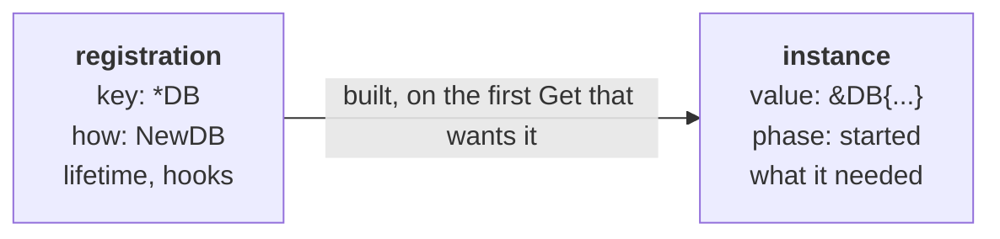
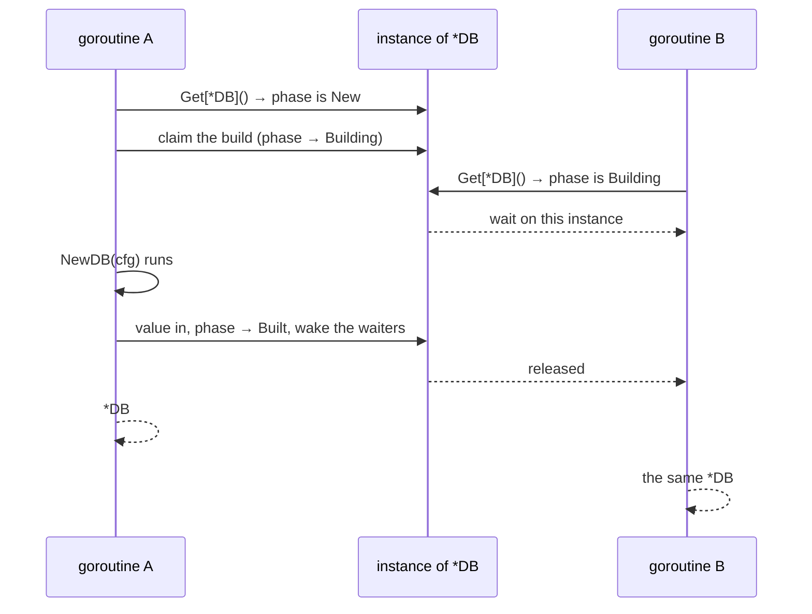
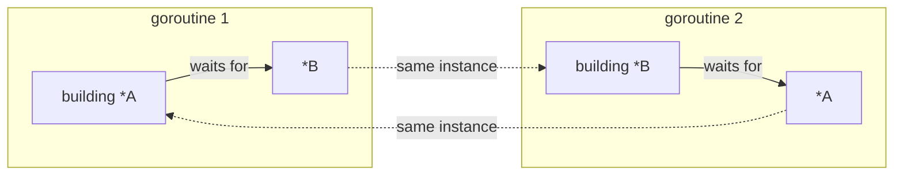
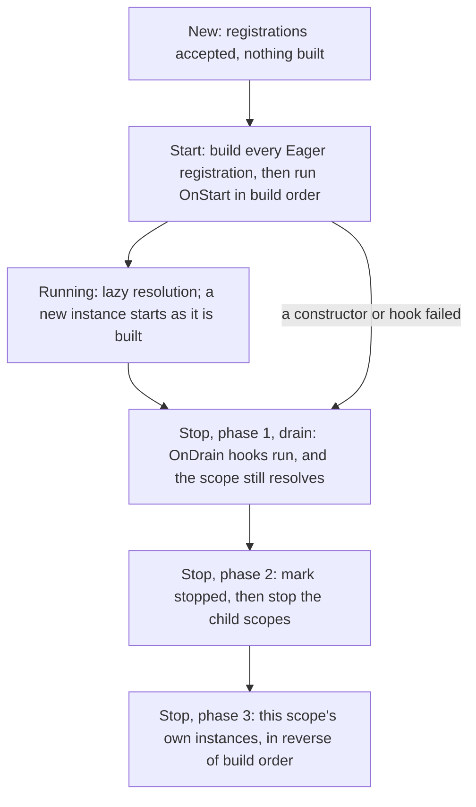

# How `di` works

What happens between `s.Get[T]()` and getting a `T`, drawn out. Read the
[README](../README.md) first for the API; this explains the machinery under
it, and why shutdown, scopes and cycles behave the way they do.

## Registrations and instances are different things

Registering writes down *how* to make something. It runs no code and produces
no value:

```go
app.Wire[*DB](NewDB)   // a registration: the key *DB, made by NewDB
app.Get[*DB]()         // an instance: the *DB that NewDB returned
```



One registration can produce **zero, one, or many** instances:

| It produces | When |
|---|---|
| zero instances | nobody ever asks for the key |
| one instance | the default, a singleton: every scope that asks gets the same one |
| many instances, one per scope | the registration is marked `Scoped()`: every scope that asks gets its own |

That is the whole of `Scoped`. Everything below is about which instance a
given `Get` lands on.

## The four moving parts

| In the docs | In the code | What it holds |
|---|---|---|
| registration | `binding` | the key, the constructor, the lifetime, the hooks |
| built value | `instance` | one value, its phase, its errors, what it needed |
| scope | `state` | a registry, the instances it holds, its lifecycle |
| path node | `resolver` | one `Get` in flight: the registration, its holder, the node that asked |
| handle | `Scope` | a pointer to one `state`, plus the current resolution path |

`Scope` is only a handle. `app` and the `*di.Scope` a constructor receives can
point at the same `state`; what differs is the path attached to it, which is
how the container knows who asked for what.

## One resolution, end to end

`app.Get[*Repo]()`, where `*Repo` needs `*DB`, which needs `Config`:

```
app.Get[*Repo]()
 │
 │ 1  key ← *Repo                    the Go type is the key. no names, no tags
 │ 2  begin a resolution             a root path node, and a recover for the abort
 │ 3  find the registration          this scope, then its parents, one at a time
 │      └─ found in app             (pending registrations commit on the way)
 │ 4  choose the holder              singleton → the scope that registered it
 │                                   Scoped    → the scope that asked
 │ 5  cycle check                    is *Repo already further up this path?
 │ 6  find the instance              in the holder. none yet → an empty one
 │ 7  build it, once
 │      └─ the constructor runs with a Scope over the holder
 │            └─ s.Get[*DB]() ────── the same nine steps, one level down
 │ 8  publish and start              add to the holder's stop list; run OnStart
 │ 9  record the edge                *Repo needed *DB. this is what Explain draws
 │
 └──→ the *Repo
```

Step by step:

1. **The key is the type.** `Get[*Repo]()` is a map lookup on `reflect.TypeFor[*Repo]()`. Two same-named types from different packages never collide.
2. **A resolution has a path.** The path is a linked list of nodes, one per `Get` in flight, and it is what cycle reports and error messages are made of. A wiring failure deep inside travels back up as an internal panic to the call that started the resolution: an `error` from `Resolve`, `Start` or `Run`, a panic carrying that error from a top-level `Get`.
3. **Lookup walks up.** Each scope on the way commits its pending registrations, which is when a registration that cannot stand is rejected (see [One key, one live value](#one-key-one-live-value-per-scope)), then checks its own registry. The first scope that has the key wins, so a child shadows its parent. A group member is a separate registration that `All` collects from every scope on the way.
4. **The holder is chosen here**, and it is the only difference between a singleton and a `Scoped` service. See the next section.
5. **Cycle check within the branch.** If this exact registration is already being resolved further up the same path, that is `ErrCycle`.
6. **The instance is per holder.** A singleton has one instance hanging off the registration. A `Scoped` registration has a map on each scope, from registration to instance, and this step reads that map, adding an empty entry when the scope has none.
7. **Exactly one goroutine builds.** Whoever finds the instance unbuilt claims it; everyone else waits for that build rather than starting a second one.
8. **Publishing is what owes a teardown.** The instance joins the holder's stop list, and if the scope is already running, its `OnStart` runs before the value is handed back.
9. **The edge is recorded on the asking instance**, which is how `Explain` and `Graph` can draw a graph nobody declared.

## Where a value lives: the holder

> The registration lives where you wrote it. The instance lives with its holder.

```
app  ── registrations:  *DB → singleton      *User → Scoped
     └─ instances:      [*DB]                 (none: nobody asked here)
         │
         ├── request A ── instances: [*http.Request]  [*User #A]
         └── request B ── instances: [*http.Request]  [*User #B]
```

Both requests resolve `*User` through the same registration, written once in
`app`. They get different values, because the holder differs:

| Lifetime | Holder | Instances | Stopped by |
|---|---|---|---|
| singleton (default) | the scope that **registered** it | one, shared downward | that scope |
| `Scoped()` | the scope that **resolved** it | one per scope that asks | that scope |
| `Value(v)` | the scope that registered it | the value you passed | that scope |
| `Wrap` | the holder of what it wraps | one per instance of the wrapped registration | that scope, before the wrapped one |
| `Group()` member | as above, per member | each member has its own | that scope |

A wrapper resolves the registration it wraps as its first dependency, so
the wrapped value is built first and stopped after, and the wrapper takes its
lifetime: a wrapper over a `Scoped` service is itself one per scope.

Three consequences fall out of this and nothing else:

- **Nothing is ever rebuilt.** There is no staleness check anywhere. A new scope simply has an empty shelf, so the first ask there builds. Ask twice in one scope and the second ask finds the instance and returns it.
- **A `Scoped` service is not always built.** It exists only in scopes that actually resolve it, and only from that moment. This is also why `Eager` is refused on a `Scoped` registration: eager means "exists once `Start` returns", and there is no single instance for `Start` to build.
- **The constructor sees the scope that asked.** It is handed a view over the *holder*, so a `*User` constructor declared in `app` and resolved in request A resolves `*http.Request` from A. That is what makes request scopes work at all.

## One key, one live value per scope

A registration is queued when you make it and committed later, in a batch,
by the first lookup that passes through the scope. That is why a bad
registration is reported by `Get`, `Start` or `Explain` rather than at the
`Provide` line: nothing has looked yet.

```
app.Provide(...)   app.Wire[...](...)   app.Provide(...).Override()
        │                  │                       │
        └──────────────────┴───────────────────────┘  queued, not looked at
                           │
                     first lookup ──► validate the batch against a copy of the registry
                                          ├─ every registration stands → commit all
                                          └─ one is rejected → commit none, panic, same answer next time
```

The batch is checked against a copy, so a rejected batch leaves the scope
exactly as it was and is rejected identically on every later attempt. Within
one scope, one key has one live value, and four guards each close one way of
getting two:

| Guard | Rejects | Because |
|---|---|---|
| collision | a second registration of a key without `Override()` | last-wins let one module rewire another silently |
| `used` | replacing or wrapping a key that has served a value | callers already hold the old value |
| `resolving` | replacing a key while a resolution of it is in flight | the nested build would get the new value, the caller the old |
| `served` | registering a key this scope already handed down from an ancestor | the scope would have given out two values for one key |
| `wrappedBy` | overriding a registration some wrapper composes over | the wrapper would serve a value built from a registration nothing else can reach |

Two things are deliberately not guarded. A child scope shadows its parent's
key without `Override()`, because that is a different registry, not a
replacement. And `Override()` with nothing in the same scope to override is
rejected, since a fake for a service that has since been renamed would
otherwise be a registration nobody resolves.

Eagerness belongs to the key, not the registration: `Override()` inherits
it, and a replacement with a per-scope lifetime, which cannot be built once
at `Start`, is rejected at the same commit.

## The life of one instance


The phase is read and written only under the holding scope's mutex, so
deciding "has this started" and acting on it never spans two critical
sections. A failure is recorded on the instance rather than thrown away, so
every later resolution reports the same error instead of retrying and
producing a second value.

When is a stop owed? `OnStop` runs for an instance that started, and for one
that was built and had no `OnStart` to pair with, or whose scope never
started, so `OnStop` alone is a plain destructor. The instance that is not
torn down is the one whose `OnStart` was owed and did not succeed: its value
was never handed to anyone, and its hook never finished, so there is nothing
to undo.

## Two goroutines, one value



Waiting is per step, not per scope: an instance carries one channel for each
step another goroutine can be responsible for finishing, the build, the start
step and the drain hook, and each is created only when somebody actually has
to wait. An uncontended build allocates none of them. The drain channel is
what lets `Stop` wait out an `OnDrain` still running for a value it is about
to release.

## Two cycle detectors

One resolution's path catches a cycle inside a single branch. It cannot catch
a cycle closed by two goroutines, because each branch sees only itself:



So before a resolution blocks on an instance somebody else is building, it
searches a wait-for graph shared by the whole container: instances point at
the resolution building them, blocked resolutions point at what they wait for.
Finding itself means `ErrCycle` rather than a deadlock. The check and the edge
it adds happen in one critical section, or two branches closing a cycle at the
same moment would both decide to wait.

## The life of a scope



Two orderings carry most of the weight. **Children before parents**, so
nothing is torn down while something that depends on it is still alive. And
**draining before anything is stopped**, which is the phase an HTTP server
uses to finish in-flight requests: those requests still hold their scopes and
everything under them, which would not be true from `OnStop`.

`Stop` is synchronous. It waits for start steps, drain hooks and `Worker`
functions it has cancelled. The single exception is its own context expiring,
in which case the missed deadline is reported to the caller and the release
finishes on its own goroutine, reaching observers either way. A second
`Stop`, concurrent or later, does not run a second teardown: it waits for the
first and reports its result, which is what keeps a child and its parent in
order when both are stopped at once.

A stopped scope refuses to serve. A resolution begun after `Stop` fails with
`ErrStopped`, and the check is made twice: on the way in, and again after any
wait, because a scope can stop while a resolution is parked on somebody
else's build. A build that completes after its scope stopped is undone on
the spot rather than handed out.

### Run, Shutdown and workers

`Run` is the lifecycle in one call: `Start`, then wait for `SIGINT`,
`SIGTERM` or `Shutdown`, then `Stop` within `StopTimeout`. A second signal
cancels the stop context, so a hung hook cannot keep the process alive.

```
Run(ctx) ── Start ──► running ──┬── SIGINT / SIGTERM ──┐
                                ├── s.Shutdown(cause) ─┼──► Stop(timeout) ──► return cause
                                └── a Worker returned ─┘         and every stop error
```

`Shutdown(cause)` never blocks, may be called from any goroutine, and
propagates to ancestor scopes, so a service in a child can stop the
application. The first cause wins and is what `Run` returns.

A `Worker` is a function that runs for as long as its service does. It is
started in its own goroutine as part of the start step, its context is
cancelled by `Stop`, and `Stop` waits for it to return before `OnStop` runs
and before anything it depends on is released. A worker that returns its own
error, rather than the cancellation, hands it to `Shutdown`: a dying consumer
stops the application instead of leaving it half alive.

## Errors and panics

Two kinds of failure, told apart by type:

| Kind | Example | How it arrives |
|---|---|---|
| wiring | missing dependency, cycle, failing constructor | an internal panic that unwinds to the enclosing `Resolve`, `Start` or `Run` and becomes an `error` |
| configuration | `Eager` on a `Scoped` binding, an unmarked duplicate | a plain `panic` with a string prefixed `di: ` |

So `Resolve` never panics on a wiring problem, `Get` panics with an `error`
at top level, and a wiring failure inside a constructor unwinds to whoever
started the resolution rather than taking the process down. In a goroutine a
constructor started, use `Resolve`: there is no enclosing call for a panic to
unwind to.

A constructor fails in one of two ways, both of which become the same
wiring failure: a `Wire` constructor returns `(T, error)`, and a `Provide`
closure calls `s.Must(v, err)`, which aborts on a non-nil error. A hook fails
by returning an error or by panicking; a panic in a hook is recovered into
that hook's error, so a teardown can never be left half done by one.

## What the container records, and for whom

- **Edges, while constructors run.** Each resolution appends the instance it produced to the asking instance's dependency list, which is what `Explain` and `Graph` draw. Nothing in the build, start or stop machinery reads it.
- **Declared parameters, at registration.** A constructor handed to `Wire` reports its parameter types, so `Validate` can walk the graph before anything is built, and `Explain` can draw a service that does not exist yet.
- **Events, as things happen.** Observers see a `build`, `start`, `drain` and `stop` event for every instance, with the registration site, the duration and the error if any, and a `shutdown` event with its cause.
- **The module a registration came from.** `Use` labels every registration with the module that made it, which is what error messages name when two modules collide, and what `Modules` groups by: a per-module list of what is provided, what is needed and which module serves it, what is wrapped, and which constructors are closures. It is derived from the declarations above, so there is no manifest to keep in step.

`Validate` follows the holder rule. A singleton is checked against the scope
that registered it, since that is where it is built. A `Scoped` registration
is checked as the calling scope would resolve it, and what that scope does
not provide is reported as owed rather than as an error, because a
descendant may provide it, as request scopes provide the request. Stubs
(`di.Provided[T]()`) say what such a descendant will hold; with them the
check is the one a leaf would make, and anything still unmet is an error. A
singleton that would build a `Scoped` service in its own scope, where that
service's dependencies are not, is an error whatever a descendant holds,
because that singleton never builds in a descendant.

## Design notes

**Why generic methods.** Before Go 1.27 a typed container had to expose
package-level functions such as `do.Invoke[T](injector)`, and every variation
became another function. With generic methods the whole API lives on one
concrete type and reads left to right. The trade-off is that generic methods
cannot appear on interfaces, so `*di.Scope` is concrete; substitute
dependencies through scopes rather than by mocking the container.

**Concurrency.** Resolution is safe from many goroutines, including
goroutines a constructor starts for itself. Each singleton is built at most
once however many resolutions race for it, and the resolution path is an
immutable linked list, so parallel branches share nothing. Once the scope is
running, a resolution returns only a service whose `OnStart` has finished,
waiting if another goroutine is starting it. A cycle is reported as
`di.ErrCycle` even when the two halves are being built concurrently, which
needs the wait-for graph rather than the per-branch path alone.

Three re-entrancy limits apply. In a goroutine a constructor started, use
`Resolve` rather than `Get`: `Get` reports failure by panicking, and that
panic has no enclosing call to unwind to from another goroutine. An
`OnStart` hook must not resolve a service that depends on the one being
started, which would be a wait on itself. And no hook may call `Stop` on its
own scope or an ancestor, for the same reason; `Shutdown` never blocks.

**Privacy is Go's.** Keys are types, so a service whose type is unexported can
be named, and therefore resolved, overridden, shadowed or wrapped, only by the
package that declares it. There is no visibility feature in the container, and
none is needed.

**Known limitations.** A `Provide` closure's dependencies are only known once
it runs, so a missing dependency of a lazy service surfaces on first
resolution, or at `Start` if the service is eager. `Validate` checks what
`Wire` declares and lists the closures as unchecked
([#3](https://github.com/floatdrop/di/issues/3)). `Stop` is synchronous with
one exception: when its own context expires while a hook is still running,
the missed deadline is reported to the caller and the release finishes on a
goroutine of its own, reaching observers. A build that completes after its
scope stopped is undone the same way.

## Where this lives in the source

| File | What it holds |
|---|---|
| [`di.go`](../di.go) | registration, resolution, the phase machine, scopes, lifecycle |
| [`validate.go`](../validate.go) | the walk over declared dependencies |
| [`explain.go`](../explain.go) | the two renderings of the graph |
| [`dihttp/`](../dihttp) | the net/http adapter: request scopes and handlers |
| [`examples/guide/`](../examples/guide) | one application, walked through at <https://floatdrop.github.io/di/> |
